<span id="top"></span>
# <font color=#57a892>滑價模型（Slippage Models）</font>
- 交易成本（transaction costs）被廣泛認為是影響投資績效的重要因素。它們不僅影響投資績效，還影響了將資產轉換成現金的難易度。

- 在真實世界的交易中存在許多種類的交易成本，其中一種是**間接成本（indirect cost）**，間接成本包含了**滑價（slippage）**、**流動性（liquidity）**等。因為股價隨時都在變動，下單時的些微時間差也可能造成**預期的價格與成交價有落差**，而這個價差就是**滑價**。**流動性**則會影響交易的難易度，我們通常可以用**交易量**來間接評估流動性。若股票平均來說交易量高，則通常代表該股票流動性高、可以迅速進行交易，同時滑價的影響也會降低。

- 若沒有考慮滑價及流動性可能會**高估投資策略的獲利**，特別是在投資組合中有**成交量較低（流動性差）**的股票、**資金量（capital base）大**或過度**集中交易單一個股**時，影響會更為明顯。這也是回測（backtesting）的一大目的，考量投資策略在真實世界運行的可能性。

## zipline.api.<font color=#57a892>set_slippage</font>(self, equities=None, futures=None)

設定回測時所使用的滑價模型。

> ### Parameters：
> - equities *(EquitySlippageModel, optional)* －用於交易股票的滑價模型。
>   - EquitySlippageModel：`zipline.finance.slippage`
> - futures *(FutureSlippageModel, optional)* －用於交易期貨的滑價模型。（目前不支援）
>   - FutureSlippageModel：`zipline.finance.slippage`
>  
> ### Raises：
> **SetSlippagePostInit**－`set_slippage` **只能**在 `initialize` 階段使用。
>
> ### Notes：
> - `set_slippage` 只能一次用**一種**方法。
>
> ### See also：
> - `zipline.finance.slippage.FixedSlippage`
> - `zipline.finance.slippage.VolumeShareSlippage`
> - `zipline.finance.slippage.FixedBasisPointsSlippage`
>
> ### Examples：
> ```python
> from zipline.api import set_slippage
> from zipline.finance import slippage
> 
> def initialize(context):
>     set_slippage(slippage.<其中一種 slippage models>)
> ```

## class zipline.finance.slippage.<font color=#57a892>SlippageModel</font>
> 滑價模型的抽象基類（Abstract Base Class）。
>
> 滑價模型可用來估計交易成交價與設定交易量限制。Zipline 目前有四種模型：
> 1. `FixedSlippage`：設定固定 spread 的滑價，**不能**設定成交量限制。
> 2. `VolumeShareSlippage`：根據該筆交易佔總交易量百分比來計算滑價，並可設定成交量限制。
> 3. `FixedBasisPointsSlippage`：設定固定基點的滑價，並可設定成交量限制。
> 4. `NoSlippage`：不設置滑價。

## class zipline.finance.slippage.<font color=#57a892>FixedSlippage</font>(spread=0.0)
> - 設定固定 spread 的滑價，**不能**設定成交量限制。
> - 在每筆交易的成交價格額外加入 $\pm \frac{spread}{2}$。
> - 如果是買入，則成交價格 =  $ price + \frac{spread}{2}$ ；若是賣出，則成交價格 =   $ price - \frac{spread}{2}$。$ price = 當日收盤價$。
>
> ### Parameters:
> - spread *(float, optional)* - 用來估計成交價與當日收盤價的價差。

## class zipline.finance.slippage.<font color=#57a892>VolumeShareSlippage</font>(volume_limit=0.025, price_impact=0.1)
> 利用**該筆交易佔當天總交易量的百分比**（volume share）來計算滑價，考慮滑價後的成交價計算方法如下（買入的話，符號為`+`；賣出的話，符號為`-`）:
> 
> $$ price \times [1 \pm ({price\_impact}) \times ({volume\_share}^2)], $$  
> 
> *$ price = $ 當日收盤價,*     
> *$ volume\_share = $ 此單交易量佔總交易量百分比數，最高為 $ volume\_limit $。*
> 
> 設定當日**交易量限制**：  
> $$ historical\_volume \times volume\_limit, $$
> *$ historical\_volume = $ 當日成交量。*
>
> ### Parameters:
> - volume_limit *(float, optional)* - 
>   - 限制買賣量佔總交易量的最大百分比，預設 = 2.5 %。
>   - 此限制考慮如果買賣大量股票，會對股價造成過大影響，導致偏離歷史的價格，若利用當天收盤價進行模擬交易就會高估獲利。
> - price_impact *(float, optional)* - 滑價影響程度，其值越大時，滑價影響程度越大，預設 = 0.1。

## class zipline.finance.slippage.<font color=#57a892>FixedBasisPointsSlippage</font>(basis_points=5.0, volume_limit=0.1)
> **為 zipline 預設模型**，設定**固定基點**的滑價，其計算方法為（買入的話，符號為`+`；賣出的話，符號為`-`）:
> $$ price \times [(1 \pm basis\_points \times 0.0001)] $$
>
> 設定當日**交易量限制**：
> $$ historical\_volume \times volume\_limit, $$
> *$ historical\_volume = $ 當日成交量。*
>
> ### Parameters:
> - basis_point *(float, optional)* - 設置滑價基點，基點越大，滑價程度越大，預設 = 5.0。
> - volume_limit *(float, optional)* - 
>   - 買賣量佔總交易量的最高百分比，預設 = 0.1。
>   - 此限制考慮如果買賣大量股票，會對股價造成過大影響，導致偏離歷史的價格，若利用當天收盤價進行模擬交易就會高估獲利。

## class zipline.finance.slippage.<font color=#57a892>NoSlippage</font>
> 不設置滑價。

### Notes：
- 滑價計算時，**價格以成交日收盤價為準，數量也以成交時為準**。也就是說，如果因為股數變動造成 amount 有任何變化，計算上都是用成交時新的 amount。
- 如果 `initialize(context)`: 裡面沒有設定`set_slippage()`，系統預設使用 `FixedBasisPointsSlippage(basis_points = 5.0, volume_limit = 0.1)`。
- 如果希望完全不考慮交易量及滑價限制，則使用 `set_slippage(slippage.NoSlippage())`。

[Go Top](#top)

## Examples－SlippageModel
以下範例比較各種模型計算方法。

#### Import settings

``` py linenums="1"
import pandas as pd 
import numpy as np
import tejapi
import os

# tej_key
os.environ['TEJAPI_BASE'] = 'https://api.tej.com.tw'
os.environ['TEJAPI_KEY'] = 'your key'

# set date
os.environ['mdate'] = "20221201 20221231"

# ticker
os.environ['ticker'] = "IR0001 1216 5844"
```
```py linenums="1"
# ingest
!zipline ingest -b tquant
```
```py linenums="1"
from zipline.finance import commission, slippage
from zipline.api import *

from zipline import run_algorithm  
from zipline.utils.run_algo import  get_transaction_detail
```
#### ***FixedSlippage***

[Go Top](#top)

設置交易策略
>**成本設定**
> ```python
> def initialize(context):
>   
>     ...
>     set_slippage(slippage.FixedSlippage(spread = 0.2))
>   
>     set_commission(commission.PerDollar(cost = commission_cost))
>     ...  
> ```

>**下單設定**
> - 在回測的第一個交易時間點（i 等於 0，2022-12-01）時：
> ```python
> def handle_data(context, data):
>    
>     if context.i == 0:  # 2022-12-01
>         for asset in context.asset:
>             order(asset, 5000)
>     ...
> ```
> 
> - 在回測的第八個交易時間點（i 等於 7，2022-12-12）時
> ```python
>     ...
>     if context.i == 7:  # 2022-12-12
>         for asset in context.asset:
>             order(asset, -2000)   
> ```

``` py linenums="1"
start_dt = pd.Timestamp('2022-12-01', tz='UTC')
end_dt = pd.Timestamp('2022-12-31', tz='UTC')

def initialize(context):
    context.i = 0
    context.tickers = ['1216']
    context.asset = [symbol(ticker) for ticker in context.tickers] 
    
    # 設定滑價模型來進行模擬                
    # set_slippage()只接收一個spread參數
    set_slippage(slippage.FixedSlippage(spread = 0.2))
    
    # 這裡在接收commission.PerDollar()回傳結果後輸入參數
    set_commission(commission.PerDollar(cost = commission_cost))
    
    # 設定benchmark
    set_benchmark(symbol('IR0001'))
    
def handle_data(context, data):
    
    if context.i == 0:  # 2022-12-01
        for asset in context.asset:
            order(asset, 5000)

    if context.i == 7:  # 2022-12-12
        for asset in context.asset:
            order(asset, -2000)

    context.i += 1

commission_cost = 0.001425 + 0.003 / 2
capital_base = 1e6
```
``` py linenums="1"
# 評估結果
closing_price = tejapi.fastget('TWN/APIPRCD',
                               coid=['1216'],
                               opts={'columns':['mdate','coid','close_d','vol']},
                               mdate={'gte':start_dt,'lte':end_dt },
                               paginate=True)

closing_price['vol'] = closing_price['vol'] * 1000

performance = run_algorithm(start=start_dt,
                            end=end_dt,
                            initialize=initialize,
                            handle_data=handle_data,
                            capital_base=capital_base,
                            bundle='tquant')

positions, transactions, orders = get_transaction_detail(performance)
```
***FixedSlippage - 情況 1: 買入時計算滑價***

- 12/1時下單買 5 張統一（1216）股票，12/2成交。
- 收盤價是 65.0，但因為我們設定 spread = 0.2，所以成交價（transactions.price）是 65 + 0.2 / 2 = 65.1，手續費（'commission'）是 65.1 * 5000 * 0.002925 = 952.0875（手續費是預先設定好的，這次用 PerDollar）。

```py linenums="1"
closing_price.query('(mdate == "2022-12-02")')
```
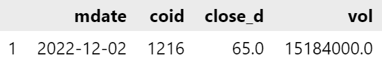

``` py linenums="1"
orders.query('(created.dt.strftime("%Y-%m-%d") == "2022-12-01")')
```
部分輸出結果如下:
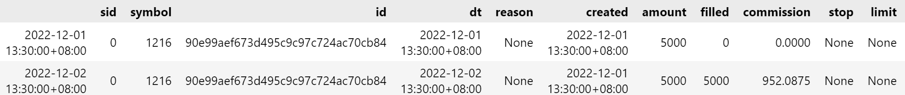

``` py linenums="1"
transactions.loc['2022-12-02']
```
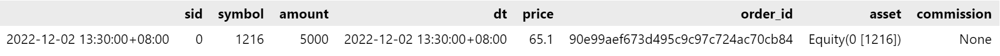

***FixedSlippage - 情況 2: 賣出時計算滑價***

- 在12/12賣出 2 張統一（1216）股票，12/13成交。
- 12/13收盤價 65.4，由於是賣單，所以成交價是 65.4 - 0.2 / 2 = 65.3，手續費計算方法一樣。 

```py linenums="1"
closing_price.query('(mdate == "2022-12-13")')
```
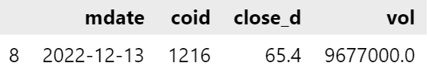

```py linenums="1"
# 在12/12賣出兩張統一 (1216) 股票，12/13成交。
orders.query('(created.dt.strftime("%Y-%m-%d") == "2022-12-12")')
```
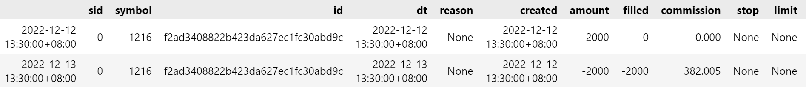

```py linenums="1"
# 成交價是65.4 - 0.2 / 2 = 65.3
transactions.loc['2022-12-13']`
```
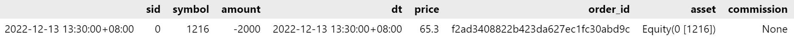

#### ***VolumeShareSlippage***

[Go Top](#top)

設置交易策略
>**滑價設定**
> ```python
> def initialize(context):
>     ...
>     set_slippage(slippage.VolumeShareSlippage(volume_limit=0.025, price_impact=0.1))
>     ...
> ```    

>**下單設定**
> - 在回測的第一個交易時間點（i 等於 0，2022-12-01）時：
> ```python
> def handle_data(context, data):
>     if context.i == 0: # 2022-12-01
>         for asset in context.asset:
>             order(asset, 1500000)  
>     ...
> ```   
> 
>- 在回測的第十一個交易時間點（i 等於 10，2022-12-15）時
> ```python
>     ...
>     if context.i == 10: # 2022-12-15
>         for asset in context.asset:
>             order(asset, -200000)    
> ```

```py linenums="1"
def initialize(context):
    context.i = 0
    context.tickers = ['1216']
    context.asset = [symbol(ticker) for ticker in context.tickers]  
    
#     set_slippage
    set_slippage(slippage.VolumeShareSlippage(volume_limit=0.025, price_impact=0.1))
    
    set_commission(commission.PerDollar(cost = commission_cost))
    set_benchmark(symbol('IR0001'))
    
def handle_data(context, data):
    
    if context.i == 0: # 2022-12-01
        for asset in context.asset:
            order(asset, 1500000)       
    
    if context.i == 10: # 2022-12-15
        for asset in context.asset:
            order(asset, -200000)    

    context.i += 1

capital_base = 1e8
```
```py linenums="1"
performance = run_algorithm(start=start_dt,
                            end=end_dt,
                            initialize=initialize,
                            handle_data=handle_data,
                            capital_base=capital_base,
                            bundle='tquant')

positions, transactions, orders = get_transaction_detail(performance)
```
***VolumeShareSlippage - 情況 1: 買入時計算滑價***

- 在12/1下單 1500 張統一，但觀察成交量資料發現，這段期間每日成交量大約只有數千到一萬多張（從 TEJ API（TWN/APIPRCD）取得的成交量（vol）單位是千股，但為了一致性，所以我們這邊**將千股轉換成股**，**利用 order 下單時的單位也是股**）。
- 因為我們設定 volume_limit = 0.025，使得 zipline 會把這筆訂單拆成數天慢慢消化，每天成交量不超過該股票總成交量的 2.5%。

```py linenums="1"
# 1216每日成交量大約只有數千到一萬多張（vol單位是千股）
closing_price.query('(mdate >= "2022-12-01")')
```
部分輸出結果如下:
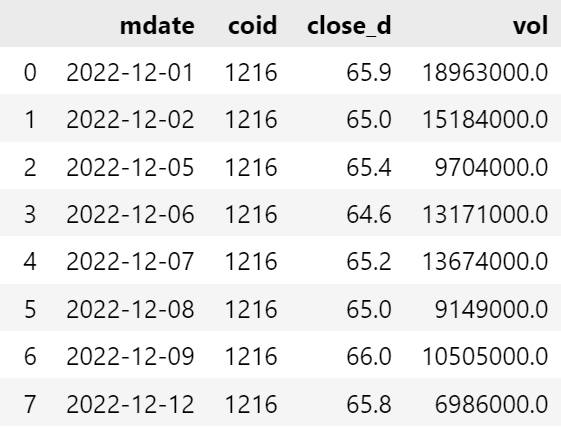

```py linenums="1"
# 在12/1下單一千五百張統一
orders.loc['2022-12-01']
```
部分輸出結果如下:
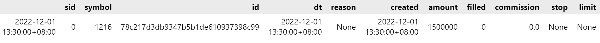

12/2的總成交量是 15184000 股，由於我們設定 volume_limit = 0.025，因此 VolumeShareSlippage 會把12/2的成交量限制在2.5%，也就是379600股。

成交價（transactions.price）計算方法是：原始收盤價 * ( 1 + price_impact * volume_share ^ 2 ) = 65 * ( 1 + 0.1 * 0.025 ^ 2 ) $\approx$ 65.004063
- price_impact 是預先設定好的0.1，且因為此處為買單，所以符號為正。

```py linenums="1"
orders.loc['2022-12-02']
```
部分輸出結果如下:
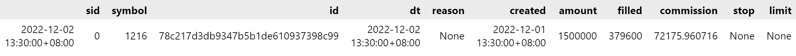

```py linenums="1"
transactions.loc['2022-12-02']
```
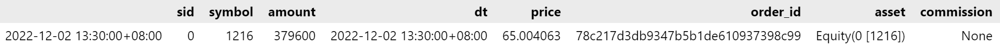
orders 資料中的 filled 為累積成交量:
- 12/7的 filled = 1293325 股，代表 12/2 到 12/7 成交的累計股數 = 379600 + 242600 + 329275 + 341850 = 1293325。
- 截至12/8已經買滿了 1500 張，所以最後 status 就會從0 變成 1，代表當初下的 1500 張已經全數成交。

```py linenums="1"
orders.query('(created.dt.strftime("%Y-%m-%d") == "2022-12-01")')
```
部分輸出結果如下:
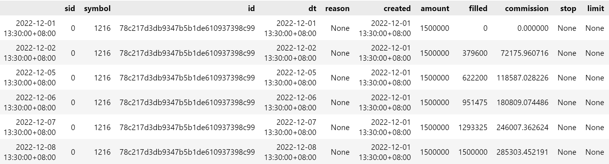

***VolumeShareSlippage - 情況 2: 賣出時計算滑價***

- 在 12/15 下單賣出 200 張統一，因為在12/16總交易量是 10721 張，volume_share = 200 / 10721 $\approx$ 0.018655小於 0.025，所以12/16一天就能賣掉。
- 成交價（transactions.price）是 65.3 * ( 1 - 0.1 * 0.018655 ^ 2 ) = 65.297728（賣出的話是減）。

```py linenums="1"
closing_price.query('(mdate >= "2022-12-16")')
```
部分輸出結果如下:
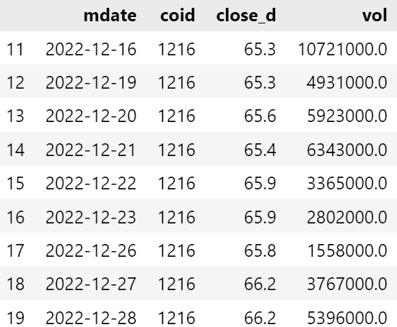

```py linenums="1"
orders.query('(created.dt.strftime("%Y-%m-%d") == "2022-12-15")')
```
部分輸出結果如下:
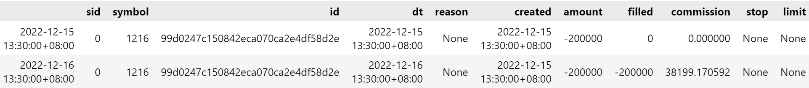

```py linenums="1"
transactions.loc['2022-12-16']
```
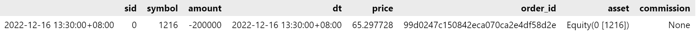

#### ***FixedBasisPointsSlippage***

[Go Top](#top)

設置交易策略
>**滑價設定**
> ```python
> def initialize(context):
>     ...
>     set_slippage(slippage.FixedBasisPointsSlippage(basis_points=5.0, volume_limit=0.025))
>     ...
> ```      

>**下單設定**
>- 在回測的第一個交易時間點（i 等於 0，2022-12-01）時
> ```python
> def handle_data(context, data):
>     if context.i == 0: # 2022-12-01
>         for asset in context.asset:
>             order(asset, 1500000)   
>     ...
> ```    
>- 在回測的第十一個交易時間點（i 等於 10，2022-12-15）時
> ```python
>     ...
>     if context.i == 10: # 2022-12-15
>         for asset in context.asset:
>             order(asset, -200000)    
> ```

```py linenums="1"
def initialize(context):
    context.i = 0
    context.tickers = ['1216']
    context.asset = [symbol(ticker) for ticker in context.tickers]  
    
#     set_slippage
    set_slippage(slippage.FixedBasisPointsSlippage(basis_points=5.0, volume_limit=0.025))
    
    set_commission(commission.PerDollar(cost = commission_cost))
    set_benchmark(symbol('IR0001'))
    
def handle_data(context, data):
    
    if context.i == 0: # 2022-12-01
        for asset in context.asset:
            order(asset, 1500000)       
    
    if context.i == 10: # 2022-12-15
        for asset in context.asset:
            order(asset, -200000)    

    context.i += 1

capital_base = 1e8
```
```py linenums="1"
performance = run_algorithm(start=start_dt,
                            end=end_dt,
                            initialize=initialize,
                            handle_data=handle_data,
                            capital_base=capital_base,
                            bundle='tquant')

positions, transactions, orders = get_transaction_detail(performance)
```
***FixedBasisPointsSlippage - 情況 1: 買入時計算滑價***

在12/1下單 1500 張統一，成交量限制和`VolumeShareSlippage`範例相同，不多做敘述。所以12/1下的單到了12/8才完全成交。

以12/2為例，成交價（transactions.price）計算方法是：原始收盤價 * ( 1 + basis_point * 0.0001 ) = 65 * ( 1 + 5 * 0.0001 ) $\approx$ 65.0325
- basis_point 是預先設定好的 5，且因為此處為買單，所以符號為正。
```py linenums="1"
closing_price.query('(mdate == "2022-12-02")')
```
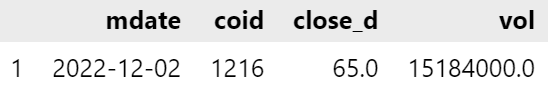
```py linenums="1"
orders.query('(created.dt.strftime("%Y-%m-%d") == "2022-12-01")')
```
部分輸出結果如下:
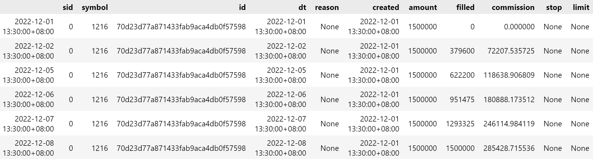
```py linenums="1"
transactions.loc['2022-12-02']
```
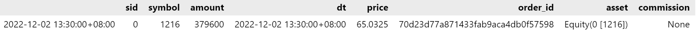

***FixedBasisPointsSlippage - 情況 2: 賣出時計算滑價***

在12/15下單賣出 200 張統一。

成交價計算方法是：原始收盤價 * ( 1 - basis_point * 0.0001 ) = 65.3 * ( 1 - 5 * 0.0001 ) $\approx$ 65.26735
- basis_point 是預先設定好的 5，且因為此處為賣單，所以符號為負。

```py linenums="1"
closing_price.query('(mdate == "2022-12-16")')
```
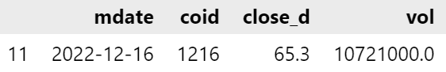

```py linenums="1"
orders.query('(created.dt.strftime("%Y-%m-%d") == "2022-12-15")')
```
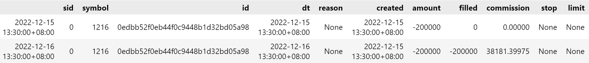

```py linenums="1"
transactions.loc['2022-12-16']
```
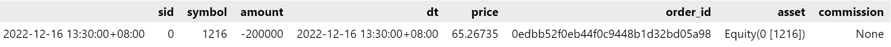

[Go Top](#top)